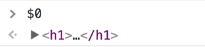

# Wes Bos: React for Beginners


Course streams https://courses.wesbos.com/account

Starter code https://github.com/wesbos/React-For-Beginners-Starter-Files

## 01. Introduction, Tooling and Editor Setup

Install:
- nodejs
- Chrome plugin for react
- VSCode plugin for Babel

## 02. Thinking and Understanding React Components

Install npm dependencies from `package.json`
- `react-scripts` does compilation to run in browser; 
  Similar to Babel or webpack
- `autoprefixer-stylus` and `stylus` for styling
- `firebase` as the db
- `re-base` realtime sync for db
- `prop-types` specify what/how data is passed in;
  split from OG react
- `react-...` core react libraries

`scripts` allow commands to be run e.g. `start` to start web
server

[:ship: f972a8a](https://github.com/arafatm/learn_wesbos_react_for_beginners_starter/commit/f972a8a) 
```bash
npm install
```

If install fails, `rm -f package-lock.json` and `node_modules`
folders

`npm start` to start the web server

[:ship: a1cb141](https://github.com/arafatm/learn_wesbos_react_for_beginners_starter/commit/a1cb141) test this works with an alert hello world
- edit `src/index.js` and add a `alert("hi")`

You can find the :point: code compiled 
- View source 
- search for `alert("hi")` on one of these compiled js files

```html
<script src="/static/js/bundle.js"></script><script src="/static/js/0.chunk.js"></script><script src="/static/js/main.chunk.js"></script></body>
```

## 03. Creating our First Components

Everything in React is a **Component**
- reusable code
- allows you to build your own "html" tags e.g. `<Fish />`

[:ship:
fa5d7b2](https://github.com/arafatm/learn_wesbos_react_for_beginners_starter/commit/fa5d7b2)
Our first `React.Component` with required `render()` 
- note that nothing will happen because we haven't **mount**ed our component

React allows us to not directly edit the DOM
- **except** when mounting React

[:ship:
a806486](https://github.com/arafatm/learn_wesbos_react_for_beginners_starter/commit/a806486)
`react-dom.render` to attach to DOM

[:ship:
ed5fb21](https://github.com/arafatm/learn_wesbos_react_for_beginners_starter/commit/ed5fb21)
Refactor StorePicker into it's own component class 
- Have to `export` the component in order to `render` in the DOM

## 04. Writing HTML with JSX

[:ship:
7b9e90a](https://github.com/arafatm/learn_wesbos_react_for_beginners_starter/commit/7b9e90a)
:warning: **not advised** example using `React.CreateElement` to render instead
of JSX
- **note** the use of `className` to set CSS class on a component

[:ship: a012ae1](https://github.com/arafatm/learn_wesbos_react_for_beginners_starter/commit/a012ae1) 
:warning: This example won't work since `return` expects single line
- [:ship: 60e4c1c](https://github.com/arafatm/learn_wesbos_react_for_beginners_starter/commit/60e4c1c)
  To fix previous example wrap multiline return in `return ( ... )`

[:ship: e7df666](https://github.com/arafatm/learn_wesbos_react_for_beginners_starter/commit/e7df666)
Also cant return sibling elements
- [:ship: fc69d9c](https://github.com/arafatm/learn_wesbos_react_for_beginners_starter/commit/fc69d9c)
  To allow sibling elements, use a `<React.Fragment>`

[:ship: b8f946a](https://github.com/arafatm/learn_wesbos_react_for_beginners_starter/commit/b8f946a) Example of a comment


## 05. Loading CSS into our React Application

[:ship: 6789e0c](https://github.com/arafatm/learn_wesbos_react_for_beginners_starter/commit/6789e0c) 
Set up initial store picker

[:ship: 01005df](https://github.com/arafatm/learn_wesbos_react_for_beginners_starter/commit/01005df)
Import CSS

## 06. Creating our application layout with components

[:ship: d59778d](https://github.com/arafatm/learn_wesbos_react_for_beginners_starter/commit/d59778d)
Create main `src/components/App.js`

[:ship: a88878e](https://github.com/arafatm/learn_wesbos_react_for_beginners_starter/commit/a88878e)
Use `App` as default component

[:ship: 411df3b](https://github.com/arafatm/learn_wesbos_react_for_beginners_starter/commit/411df3b)
Scaffold out our App with needed components

[:ship: d9e48e7](https://github.com/arafatm/learn_wesbos_react_for_beginners_starter/commit/d9e48e7)
Skeleton `Header`, `Inventory`, and `Order` components

[:ship: bb0b977](https://github.com/arafatm/learn_wesbos_react_for_beginners_starter/commit/bb0b977)
Header component with some pretty css

## 07. Passing Dynamic data with props

**State** is the data home

**Props** is where the data goes

[:ship: 3cc09b2](https://github.com/arafatm/learn_wesbos_react_for_beginners_starter/commit/3cc09b2) 
Example of using **props** 
- note that non-strings need to be escaped
- You can view the props in React console

:fire: 
When looking at code in the inspector, when you select an html node you'll see
something like ` == $0`. You can type that in the console to inspect that
element.
- Also, can `$1`, `$2`, etc for history of elements selected



Nodes rendered by React will have `$r` as seen in the React DevTools inspector 

[:ship: e700f14](https://github.com/arafatm/learn_wesbos_react_for_beginners_starter/commit/e700f14) 
Pass final props to Header

## 08. Stateless Functional Components

Full `React.Component` allows things like
- define custom state
- define custom functions
- lifecycle methods e.g. `ComponentWillUnmount()`

**Stateless Functional Components** are **dumb components**. Defined as a
`function` with a single `return`
- :warning: Can't `this.props` so have to pass props as function param

[:ship: f04ecef](https://github.com/arafatm/learn_wesbos_react_for_beginners_starter/commit/f04ecef)
Example of simple **Stateless Functional Component**

[:ship: ecddb6b](https://github.com/arafatm/learn_wesbos_react_for_beginners_starter/commit/ecddb6b)
Stateless Functional Component as an **arrow function** with **implicit
return**
- No real benefit afaik

:warning: Maybe not the best idea in case you need to conver the
component to stateful component

## 09. Routing with React Router

2 popular routers: `React-Router` and `Next.JS`
- using `React-Router` in this tutorial

[:ship: ecddb6b](https://github.com/arafatm/learn_wesbos_react_for_beginners_starter/commit/3ab66f2)
Define our first root **route**

[:ship: 927391e](https://github.com/arafatm/learn_wesbos_react_for_beginners_starter/commit/927391e)
Route for `/store/:id`

[:ship: d42baf3](https://github.com/arafatm/learn_wesbos_react_for_beginners_starter/commit/d42baf3)
Handle a catch-all 404 route

## 10. Helper and Utility Functions

Included in starter project is [helper.js](./catch-of-the-day/src/helpers.js)
- Note we `export function` vs `export default ...` in React
- :point_up: allows us to select which function we want to import in our React app

[:ship: b3a25ad](https://github.com/arafatm/learn_wesbos_react_for_beginners_starter/commit/b3a25ad)
Example of using helper

## 11. Events, Refs and this Binding

React wraps your events in
[SyntheticEvents](https://reactjs.org/docs/events.html) to ensure cross browser
compatibility

[:ship: e1924e1](https://github.com/arafatm/learn_wesbos_react_for_beginners_starter/commit/e1924e1)
Example of click event handler

[:ship: 2586acf](https://github.com/arafatm/learn_wesbos_react_for_beginners_starter/commit/2586acf)
:warning: Trying to use `ref` but `this` isnt referencing correctly. Have to
use component lifecycle methods
- :fire: `render()` gets called before `componentDidMount` 

[:ship: d4f5828](https://github.com/arafatm/learn_wesbos_react_for_beginners_starter/commit/d4f5828)
:warning: Using `componentDidMount` we can now reference `this`; 
- However, `this` is not available in custom methods in component

[:ship: ae878d3](https://github.com/arafatm/learn_wesbos_react_for_beginners_starter/commit/ae878d3)
use constructor to bind my custom method with `bind(this)` 
- :warning: Note that `super()` is required

[:ship: bc91a24](https://github.com/arafatm/learn_wesbos_react_for_beginners_starter/commit/bc91a24)
:fire: Alternative to bind in constructor (which would be required for each
method) is to declare a **property** set to an **arrow** function 
- Property is bound to the instance

## 12. Handling Events

[:ship: 51de9f1](https://github.com/arafatm/learn_wesbos_react_for_beginners_starter/commit/51de9f1)
now that the event handler is bound correctly we have access to
`this.myInput.current.value`

Because StorePicker is a child of Router, we have access to `history` and `location`

[:ship: 0209e27](https://github.com/arafatm/learn_wesbos_react_for_beginners_starter/commit/0209e27)
Complete the routing based on the event 
- :warning: note the use of backticks in the `this.props.history.push`

:fire: You can see `this.props.history` in the React console

## 13. Understanding State

**State** is an object that holds data that itself and it's children need

[:ship: d928af6](https://github.com/arafatm/learn_wesbos_react_for_beginners_starter/commit/d928af6)
Extract AddFishForm into its own reusable component

[:ship: fa0d104](https://github.com/arafatm/learn_wesbos_react_for_beginners_starter/commit/fa0d104)
Completed Add Fish form

[:ship: 4a3f459](https://github.com/arafatm/learn_wesbos_react_for_beginners_starter/commit/4a3f459)
Create **Ref** to all form inputs

[:ship: dcc70e0](https://github.com/arafatm/learn_wesbos_react_for_beginners_starter/commit/dcc70e0)
Added helpers for defaultValues on Inventory form

[:ship: e2aa4ee](https://github.com/arafatm/learn_wesbos_react_for_beginners_starter/commit/e2aa4ee)
Price is a float, not str

:warning: Data can be passed down to children, but not to parent. We need to
move the Inventory Data into App so it's accessible to Order and Header

[:ship: 81467b4](https://github.com/arafatm/learn_wesbos_react_for_beginners_starter/commit/81467b4)
Set up App to handle **state**

[:ship: 26470c0](https://github.com/arafatm/learn_wesbos_react_for_beginners_starter/commit/26470c0)
App.addfish method

[:ship: 172e822](https://github.com/arafatm/learn_wesbos_react_for_beginners_starter/commit/172e822)
Pass reference to App.addFish as a **prop** to Inventory and AddFishForm

[:ship: 4d7d1de](https://github.com/arafatm/learn_wesbos_react_for_beginners_starter/commit/4d7d1de)
Call App.addFish from AddFishForm

How do we add a fish to the State :point_up:?
- `this.state.fishes.push(fish);` If this was an Array
- `this.state.fishes.fish1 = fish;` If this was an Object

**However**, React provides it's own methods for State management with `setState`

[:ship: 916decf](https://github.com/arafatm/learn_wesbos_react_for_beginners_starter/commit/916decf)
Manage App.state.fishes using **setState**

[:ship: a51b7df](https://github.com/arafatm/learn_wesbos_react_for_beginners_starter/commit/a51b7df)
Refresh AddFishForm on Submit with `e.currentTarget.reset()`

:fire: `setState` is able to update individual pieces of state. In examples
above we `setState({ fishes })` ignoring `order` which is also managed in the
same state

## 14. Loading data into state onClick

Provide a button `loadSampleFishes`

[:ship: de9e4e7](https://github.com/arafatm/learn_wesbos_react_for_beginners_starter/commit/de9e4e7)
Wire up App.loadSampleFishes in Inventory as a **prop**

[:ship: e142dea](https://github.com/arafatm/learn_wesbos_react_for_beginners_starter/commit/e142dea)
Add sample Fishes to App state

## 15. Displaying State with JSX

Display all Fish in the Header Component.

[:ship: 2a7c04e](https://github.com/arafatm/learn_wesbos_react_for_beginners_starter/commit/2a7c04e)
Set up Fish component

:warning: JSX does not have flow control. Have to use regular JS

:computer: In the Console, try `$r.state.fishes`

[:ship: f99518f](https://github.com/arafatm/learn_wesbos_react_for_beginners_starter/commit/f99518f)
Iterate over fishes state keys with `Object.keys` and `map`

:warning: **In order for React to be performant, it requires props to have keys.**

At this point the console spits out 
`Warning: Each child in a list should have a unique "key" prop.`

[:ship: 7efb4cd](https://github.com/arafatm/learn_wesbos_react_for_beginners_starter/commit/7efb4cd)
Pass a key to Fish to avoid warning :point_up:

[:ship: 966486a](https://github.com/arafatm/learn_wesbos_react_for_beginners_starter/commit/966486a)
Render Fish passing "details" as a prop. 
- :warning: details is not a keyword, can use anything we want

:fire: In the next example note the use of [ES6 Destructuring](https://hacks.mozilla.org/2015/05/es6-in-depth-destructuring/) to quickly set variables.
- e.g. `const { image, name } = this.props.details`

[:ship: e487fc3](https://github.com/arafatm/learn_wesbos_react_for_beginners_starter/commit/e487fc3)
Set up Fish component using props

[:ship: 0c6d013](https://github.com/arafatm/learn_wesbos_react_for_beginners_starter/commit/0c6d013)
Use `formatPrice` helper to prettify Fish.price

[:ship: 9a507de](https://github.com/arafatm/learn_wesbos_react_for_beginners_starter/commit/9a507de)
Display all Fish details

## 16. Updating our Order State

[:ship: 9bf0f87](https://github.com/arafatm/learn_wesbos_react_for_beginners_starter/commit/9bf0f87)
Disable "Add to Cart" button when a fish is out of inventory

[:ship: a75f72b](https://github.com/arafatm/learn_wesbos_react_for_beginners_starter/commit/a75f72b)
Using **ternary operator** display "Sold Out" when fish is unavailable

[:ship: fa003de](https://github.com/arafatm/learn_wesbos_react_for_beginners_starter/commit/fa003de)
addToOrder fn must be in App since that is where our State is

[:ship: e09f939](https://github.com/arafatm/learn_wesbos_react_for_beginners_starter/commit/e09f939)
App.addToOrder implementation

:books: To test out the function, in the React Console, select "App"
which will be assigned to `$r`. Then...

```javascript
a = $r

a.addToOrder('fish1'); 
a.addToOrder('fish1'); 
a.addToOrder('fish2');

a.state.order
// {fish1: 2, fish2: 1}
```

[:ship: 73c657d](https://github.com/arafatm/learn_wesbos_react_for_beginners_starter/commit/73c657d)
Pass App.addtoOrder to Fish

:caution: :caution: :caution: 
At this point, `Fish` can't access `this.props.keys` because `key` is a
reserved keyword. So we have to pass the key using some other keyword. 

:books: Remember that components should have keys to make React
performant. https://reactjs.org/docs/reconciliation.html#keys

[:ship: 33bafef](https://github.com/arafatm/learn_wesbos_react_for_beginners_starter/commit/33bafef)
`key` is special in react so cant pass it as a prop

[:ship: dc3881c](https://github.com/arafatm/learn_wesbos_react_for_beginners_starter/commit/dc3881c)
Pass key using keyword `index`

[:ship: 8ecc03e](https://github.com/arafatm/learn_wesbos_react_for_beginners_starter/commit/8ecc03e)
Handle button event onClick to addToOrder

[:ship: 2eb8f52](https://github.com/arafatm/learn_wesbos_react_for_beginners_starter/commit/2eb8f52)
Same as above with a one-liner

## 17. Displaying Order State with JSX

[:ship: a5ba823](https://github.com/arafatm/learn_wesbos_react_for_beginners_starter/commit/a5ba823)
Pass props to Order using an **Object Spread**

[:ship: a40dcc6](https://github.com/arafatm/learn_wesbos_react_for_beginners_starter/commit/a40dcc6)
:caution: however, dont use Object Spread. Pass what you need explicitly

[:ship: 318f19f](https://github.com/arafatm/learn_wesbos_react_for_beginners_starter/commit/318f19f)
Order div container

[:ship: 0ac2c16](https://github.com/arafatm/learn_wesbos_react_for_beginners_starter/commit/0ac2c16)
pass state.order to Order and display orderIds

[:ship: 583a513](https://github.com/arafatm/learn_wesbos_react_for_beginners_starter/commit/583a513)
Display running total cost of fish added to order
- :bulb: Using [`reduce` function](https://developer.mozilla.org/en-US/docs/Web/JavaScript/Reference/Global_Objects/Array/reduce) 

[:ship: 66bd160](https://github.com/arafatm/learn_wesbos_react_for_beginners_starter/commit/66bd160)
Use `formatPrice` helper to display cents in dollars

[:ship: 1d3c685](https://github.com/arafatm/learn_wesbos_react_for_beginners_starter/commit/1d3c685)
Use a **render function** to abstract some of the renders

[:ship: ff5c10e](https://github.com/arafatm/learn_wesbos_react_for_beginners_starter/commit/ff5c10e)
display fish with individual order price

[:ship: 6f65340](https://github.com/arafatm/learn_wesbos_react_for_beginners_starter/commit/6f65340)
If fish becomes unavailable, update the order immediately

[:ship: 7ba1277](https://github.com/arafatm/learn_wesbos_react_for_beginners_starter/commit/7ba1277)
prettify individual orders

## 18. Persisting our State with Firebase

Firebase uses websockets

Use Firebase to store fishes (inventory). Will use LocalStorage (next
chapter) to store Order

Set up FireBase
- https://console.firebase.google.com/?pli=1
- `Create a Project`
- I named the project `wesbos-react-for-beginners`

[:ship: 1dce961](https://github.com/arafatm/learn_wesbos_react_for_beginners_starter/commit/1dce961)
import `re-base` and `firebase` libraries

In FB console, https://console.firebase.google.com/project/wesbos-react-for-beginne-3d560/database
- `Database`
- `Create Database` in the Realtime Database section
- Set initial setup to allow all while in development

Get connection strings
- https://console.firebase.google.com/project/wesbos-react-for-beginne-3d560/overview
- `Web App` link (might be an icon at the top banner)
- `Register App`
- Copy the connection info `apiKey`, `authDomain`, and `databaseURL`

[:ship: 0746fe9](https://github.com/arafatm/learn_wesbos_react_for_beginners_starter/commit/0746fe9)
Initialize firebase connection

[:ship: 6b79e9b](https://github.com/arafatm/learn_wesbos_react_for_beginners_starter/commit/6b79e9b)
Set up Rebase bindings

[:ship: 0844158](https://github.com/arafatm/learn_wesbos_react_for_beginners_starter/commit/0844158)
export `firebaseApp` as a named export and `base` as a default export

Will be using
[`componentDidMount`](https://reactjs.org/docs/react-component.html#componentdidmount)
which is a method run after the component output has been rendered to the
DOM.

From the docs: `componentDidMount() is invoked immediately after a
component is mounted (inserted into the tree). Initialization that
requires DOM nodes should go here. If you need to load data from a remote
endpoint, this is a good place to instantiate the network request.`

Also see other lifecycle methods here
https://reactjs.org/docs/react-component.html#componentdidmount

[:ship: c1ef681](https://github.com/arafatm/learn_wesbos_react_for_beginners_starter/commit/c1ef681)
Sync with firebase

At this point if you go to console.firebase, under Database, you can see
the synced data from your app

:bulb: You can now change data in firebase and watch it auto sync in your
app. e.g. In firebase, change "Pacific Halibut" to "Atlantic Halibut"

[:ship: c580e93](https://github.com/arafatm/learn_wesbos_react_for_beginners_starter/commit/c580e93)
When we mount a component, if the user goes back in browser history, we have to remove the reference to firebase else we end up with a memory leak

[:ship: fa500f3](https://github.com/arafatm/learn_wesbos_react_for_beginners_starter/commit/fa500f3)
unmount component when we leave the page

xxx

## 19. Persisting Order State with localstorage


## 20. Bi-directional Data Flow and Live State Editing

## 21. Removing Items from State

## 22. Animating React Components

## 23. Component Validation with PropTypes

## 24. Authentication

## 25. Building React for Production

## 26. Deploying to Now

## 27. Deploying to Netlify

## 28. Deploying to an Apache Server

## 29. Ejecting from create-react-app

# Next courses

- (free) https://cssgrid.io/
